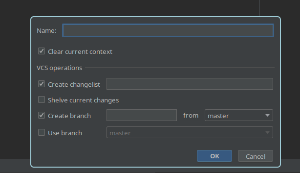
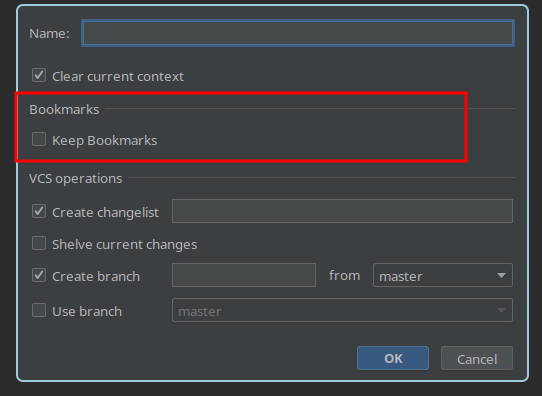

# Bookmark Keeper

If you use the Intellij Task flow, then when clearing context, you will also
lose all your bookmarks. This plugin adds a new checkbox to keep them instead:

### Before

### After

